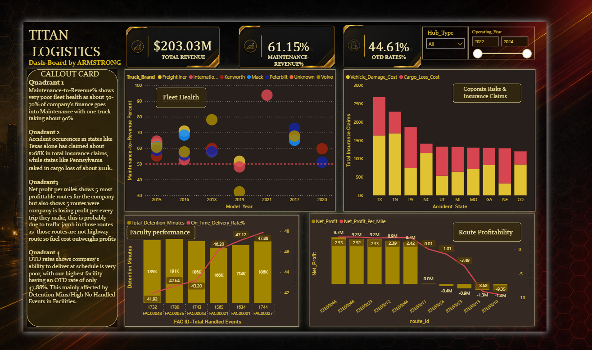

# Titan-Logistics-Analytics
End-to-end data Analysis on a Logistics Company Leveraging tools like SQL, PowerBI, MS-Excel

## 📌 Executive Summary
This enterprise data platform addresses severe profitability leaks, fleet lifecycle over-expenditures, and systemic network delivery failures for **Titan Logistics Solutions**. Operating across 14 relational data assets tracking over 200,000 supply chain transactions, this project establishes a robust end-to-end analytics engine. 

By integrating a structured **SQL Server Data Warehouse** with a dynamic, high-contrast **Power BI Executive Control Center**, this engine successfully isolated **$2.64M** in unpredictable risk liabilities, exposed acute short-haul pricing vulnerabilities costing hundreds of thousands in negative margins, and diagnosed a complex operational throughput threshold crisis across 50 national hubs.

---

## 🛠️ Data Infrastructure & Model Architecture
* **Microsoft Excel:** Power Query, Excel Formulas.
* **Data Engineering & Warehousing:** Microsoft SQL Server (SSMS), Relational Schema Design, Composite/Surrogate Keys, Common Table Expressions (CTEs), Subqueries, Advanced Windows Functions.
* **Business Intelligence & Visualization:** Power BI Desktop, DAX Measures, Cross-Filter Optimization, User Experience (UI/UX) Layout Mapping.

### 🏗️ Data Architecture Map (Star Schema Framework)
To prevent relationship multiplication traps and data inflation across the 196,000 rows of the fuel transaction tables, a strict relational architecture was established in the BI layer:

* **Fact Tables (Activity/Transactional):** `loads`, `trips`, `fuel_purchases`, `delivery_events`, `safety_incidents`
* **Dimension Tables (Master Profiles):** `drivers`, `trucks`, `trailers`, `customers`, `facilities`, `routes`
* **Data Integrity Patching:** Created structural Surrogate Composite Group Keys (`Group_UID` via `Make-Year`) and risk mapping hooks (`Risk_UID` via `State-Year`) to handle relational filtering without splitting core ledger values.

---

## 🔍 Core Analytical Narratives & Business Diagnostics

### 🗺️ 1. Route Profitability (The Short-Haul Flat Rate Trap)
* **The Diagnostic Query:** Aggregated line-haul rates, fuel surcharges, and accessorial fees against real-time fuel purchase ledgers across 58 transport lanes to derive a standardized **Net Profit per Mile** baseline.
* **The Core Discovery:** While the network generated **$298.6M in Gross Revenue** yielding **$203.0M in Net Profit**, four regional short-haul corridors were revealed as severe cash drains:
  * `RTE00010` (New York → Philadelphia): Average revenue of **$237.56** per trip against an unsustainable **$1,118.21** fuel cost, driving a crushing **-$9.35 Net Profit per Mile**.
  * `RTE00015` (Philadelphia → New York): Yielded **-$8.68 per mile**, consuming **$1,159.44** in fuel per trip against a mere **$340.98** line-haul capture.
* **Root-Cause Analysis:** The company was trapped by a linear per-mile pricing model that completely ignored metropolitan highway idling times and urban Traffic Jamb. Short routes like RTE00010 & RTE00015 run through the most congested traffic corridors in America. The trucks spend hours idling in traffic, burning fuel while moving zero miles.
* **Strategic Prescription:** Immediately freeze volume on `RTE00010` and `RTE00015`. Implement a flat **Short-Haul Minimum Floor Rate of $1,200** for all regional trips under 200 miles to capture baseline fuel expenditures before asset dispatch.

### 🚛 2. Fleet Health & Economic Lifecycle Audit
* **The Diagnostic Query:** Linked multi-year maintenance transactions (parts and labor costs) and equipment downtime logs to the master vehicle registry, calculating a corporate **Maintenance-to-Revenue Ratio** across equipment profiles.
* **The Core Discovery:** Systemic operational decay was uncovered: the entire active fleet's maintenance overhead exceeded **55%** of generated asset revenue (industry healthy benchmarks sit between 10% and 15%). 
  * **The 2021 International Anomaly:** A single, modern asset generated **$2.71M** in revenue but ran up an astonishing **$2.54M** in repair bills (**93.83% Maintenance Ratio**) alongside **28,364 hours of static shop downtime**, isolating it as a severe product failure or unrecovered major wreck loss.
  * **The 2015 Aging Fleet Wave:** A fleet segment of 68 units (crossing 11 years of field service) was responsible for a crushing **$100.3M** in maintenance outlays against **$164.6M** in generated revenue.
* **Strategic Prescription:** Implement a rapid multi-phase decommission and liquidation plan for the 68 obsolete 2015 units to leverage salvage values for newer equipment leasing. Open an internal legal/warranty audit into the 2021 International asset profile to initiate corporate recovery claims.

### ⏱️ 3. facility Performance
* **The Diagnostic Query:** Evaluated binary punctuality metrics across 170,000 shipping and receiving node events, isolating average **Detention Minutes** against true **On-Time Delivery (OTD) Rates** grouped by facility architecture.
* **The Core Discovery:** The supply chain was experiencing a total punctuality collapse, with a network-wide OTD rate trapped flat at a dismal **44.5%**. My analysis revealed that although Total Detention minutes is a Primary cause for the low OTD, it wasn't the only factor. Instead, a severe **Volume Overload & Throughput Capacity Crisis** was exposed:
  * `FAC00046` (Los Angeles Distribution Center) handled maximum detention (**191,244 mins**) but managed a **45.01% OTD**, outperforming 31 other hubs.
  * Systemic failure was concentrated where handled traffic volumes surged past a critical threshold of **1,700 events per tracking window** (e.g., `FAC00048` Indianapolis Warehouse at **41.91% OTD** and `FAC00034` Charlotte Terminal at **41.92% OTD**). 
* **Root-Cause Analysis:** Hubs were systematically over-scheduled relative to localized dock-door and warehouse labor constraints. Delays were driven by peak-hour queue clustering and dispatch sequencing failures, paralyzing outbound schedule adherence regardless of minor detention fluctuations.
* **Strategic Prescription:** Deploy a real-time Yard Management System (YMS) to synchronize gate appointments with active warehouse staffing. Transition regional accounts from "Live Loading" to a "Drop-and-Hook" trailing structure to shrink carrier cycle times from 107 minutes down to a target of 15 minutes.

### ⚠️ 4. Corporate Safety Risk & Insurance Claims Exposure
* **The Diagnostic Query:** Mapped historical fleet collision records, fault-determination metrics, and cargo-loss ledgers geographically and chronologically to pinpoint high-liability lanes.
* **The Core Discovery:** Over the 3-year tracking horizon, 168 safety incidents occurred (with a **31.55% At-Fault Driver Rate**), causing a total cash drainage of **$2,639,757.77** in insurance claims. This liability was heavily split between Vehicle Damage Overhead (**$1.59M**) and Cargo Loss Write-Offs (**$1.05M**).
  * **Geographic Hotspots:** Liabilities were aggressively concentrated within key multi-lane highway corridors: Texas (**$268.4K** total claims driven by severe cargo destruction) and Tennessee (**18 major incidents** dominated by vehicle structural damage).
  * **The Temporal Rebound:** Safety mitigation protocols successfully reduced at-fault driver errors to a low of 13 incidents in 2023 (saving over $230K). However, 2024 experienced an immediate risk resurgence, spiking back to peak levels of 58 incidents and 20 at-fault errors due to compliance dilution.
* **Strategic Prescription:** Mandate immediate deployment of inward/outward AI telematics smart-cameras across regional tractors to mitigate distracted driving behaviors by up to 40%. Reinstate the strict 2023 driver training compliance framework to reverse the high-dollar claim surge observed in 2024.

---

## 🎨 Enterprise Dashboard
Final Visualization of these analysis Shows a high-contrast, single-page **Executive Command Dashboard** engineered for rapid executive scanning

1. **Top KPI Banner:** Monitors dynamic **Net Profit**, **Maintenance-to-Revenue Percentages**, and average **OTD Rates**.
2. **Dynamic Cross-Filters:** Integrated dual-axis slicers tracking **Operating Year** and **Infrastructure Hub Type** 
3. **The Layout Matrix:** Map visual structures, combined column-line charts tracking revenue versus margin erosion, and stacked financial liability bars representing total structural loss.

---

